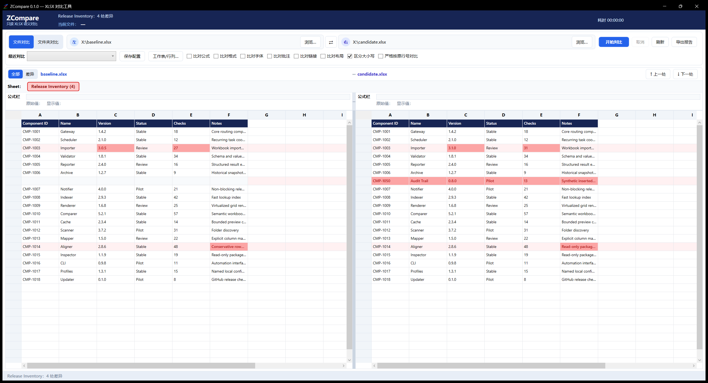

# ZCompare

[English](README.md) · [安装指南](docs/INSTALL.zh-CN.md) · [更新记录](CHANGELOG.md) · [安全策略](SECURITY.md)

ZCompare 是面向长期跨版本管理、维护 XLSX 文件用户的只读 Windows 对比工具。它支持双工作簿与双文件夹对比，能够保守对齐插入/删除行，并在同步滚动的左右表格中清晰展示结果。

> 首次公开预览版：**v0.1.0**，支持 Windows 10/11 x64，仅支持真实 OOXML `.xlsx` 文件。



## 为什么选择 ZCompare

- **默认规则明确：** 默认只比较单元格保存值并区分大小写；任何空格、制表符、换行增删都算差异。
- **插行不级联标红：** 保守行对齐只用完全一致的行做锚点；需要时仍可开启“严格按原行号对比”。
- **比较维度可控：** 公式文本、格式、字体、批注、链接和布局可以分别开启。
- **适合批量维护：** 文件夹浅扫描、勾选与搜索过滤解耦、最多两组深比、进度、取消和虚拟化网格。
- **便于审计：** JSON/XLSX 报告、CLI 退出码、源文件 SHA-256 复核、公式缓存警告、不支持容器安全拒绝。
- **全程只读：** 不编辑、不合并、不重算，也不保存源工作簿。

## 安装

只从官方 [ZCompare Releases](https://github.com/Zcube7/ZCompare/releases) 页面下载。

- **普通用户推荐：** `ZCompare-0.1.0-win-x64-setup.exe`。当前用户安装，无需管理员权限，也无需预装 .NET。
- **开发者/高级用户：** `ZCompare-0.1.0-win-x64-portable-fdd.zip`。需要 .NET 10 Desktop Runtime x64，包含 GUI 与 CLI。
- 使用 `SHA256SUMS.txt` 校验下载文件。

首版暂未购买代码签名，Windows SmartScreen 可能显示风险提示。请先核对 GitHub 官方仓库、文件名和 SHA-256，再按正常流程选择 **“更多信息”→“仍要运行”**；不要关闭 SmartScreen。

完整指南：[普通安装、便携版、源码与 AI 辅助安装](docs/INSTALL.zh-CN.md)

## 基本使用

1. 选择“文件对比”或“文件夹对比”。
2. 选择左右路径。
3. 保持默认即可按保存值、区分大小写比较；也可以开启所需的高级维度。
4. 文件夹模式先扫描，勾选要深比的行，再点击“对比”。
5. 打开结果查看对齐后的工作表、跳转差异，或导出 JSON/XLSX 报告。

公式结果始终来自 XLSX 内已保存的缓存；ZCompare 不调用 Excel，也不运行公式引擎。缓存缺失或可能过期时会明确警告，不会静默判为相同。

## 高级对齐

- 默认保守精确行对齐：插入/删除行只报告一次，不让后续相同内容整体错位。
- 严格原行号模式：恢复地址对地址比较。
- 每张工作表可配置单列或复合关键列。
- 工作表可按名称、顺序或手工映射配对。
- 支持显式左右列映射；不会自动猜测列移动。

## CLI

```powershell
zcompare --version
zcompare file left.xlsx right.xlsx --report result.json
zcompare folder left-folder right-folder --pattern "*.xlsx" --no-subdirectories --report result.xlsx
zcompare file left.xlsx right.xlsx --formulas --formatting --fonts
```

运行 `zcompare --help` 查看工作表配对、关键列、列映射和退出码说明。

## 从源码构建

需要 Windows 10/11 x64 与 [.NET SDK 10](https://dotnet.microsoft.com/download/dotnet/10.0)。

```powershell
git clone https://github.com/Zcube7/ZCompare.git
cd ZCompare
dotnet restore ZCompare.slnx
dotnet build ZCompare.slnx -c Release --no-restore
$env:WINDIR = $env:SystemRoot
dotnet test ZCompare.slnx -c Release --no-build
dotnet run --project src/ZCompare.App/ZCompare.App.csproj
```

## 更新与隐私

窗口加载后，ZCompare 最多每 24 小时异步访问一次 GitHub Releases。发现更高的稳定版本时，会显示不打扰的提示条，并在浏览器中打开官方安装包下载地址；程序不会静默下载安装包，也不会自动执行安装。

- 无遥测，不上传工作簿或报告。
- 更新请求只向 GitHub 发送标准 HTTP 头和程序版本。
- 最近路径与命名配置只保存在 `%LocalAppData%\ZCompare`。
- 错误提示仅在本机显示；v0.1.0 不生成或上传诊断日志。
- 对比前后复核源文件 SHA-256，ZCompare 不写入源文件。

完整隐私和 AI 辅助安装注意事项见[安装指南](docs/INSTALL.zh-CN.md)。

## 当前边界

不支持 `.xls`、`.xlsm`、CSV、TSV、文本或二进制比较，不提供编辑、合并、VBA 处理或公式重算。ISO Strict 工作簿当前会明确提示不支持并安全停止。图表、图片、形状、条件格式、数据验证、数据透视表、名称和外部链接内容会在启用相关选项时列为未比较对象。

性能会受硬件和工作簿结构影响。在匿名化维护者基准中，左右各约 110 万个非空单元格、数十张工作表的常用比较模式约耗时 6–13 秒，峰值工作集低于 0.5 GB。该范围仅供参考，不是性能承诺。

## AI 辅助与第三方软件

项目使用 OpenAI Codex 与 Anthropic Claude 辅助需求分析、编码、测试、审阅和文档编写。最终产品决策、发布与维护责任由项目所有者承担；AI 生成内容同样需要人工审阅和自动化测试。

ZCompare 使用 Open XML SDK。OfficeCLI 仅为少量显示格式和主题色行为提供设计参考，不是构建或运行依赖。详情见 [THIRD-PARTY-NOTICES.md](THIRD-PARTY-NOTICES.md)。

## 许可证

Apache License 2.0，见 [LICENSE](LICENSE)。
